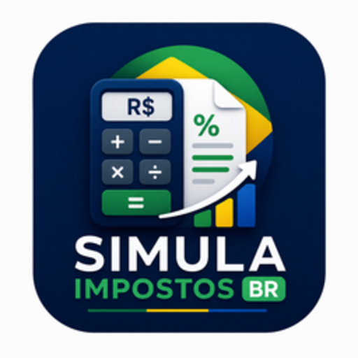

<p align="center">
  
</p>

<p align="center">
  <a href="https://github.com/thiagocajadev/simula-impostos-mvp/releases/latest"></a>
  
  
  
  
  
</p>

<h1 align="center">Simula Impostos</h1>

<p align="center">
  Calcule e compare encargos tributários brasileiros lado a lado:<br/>
  regime atual versus Reforma Tributária (EC 132/2023).
</p>

---

O contador seleciona o regime tributário, preenche os dados da nota fiscal e vê os totais sob os dois conjuntos de regras ao mesmo tempo, com um preview estilo DANFE pronto para impressão.

## Download

Baixe o instalador mais recente em [github.com/thiagocajadev/simula-impostos-mvp/releases/latest](https://github.com/thiagocajadev/simula-impostos-mvp/releases/latest).

| Plataforma | Arquivo                  |
| :--------- | :----------------------- |
| Linux      | `.AppImage` ou `.deb`    |
| Windows    | `.exe` (instalador NSIS) |
| macOS      | `.dmg`                   |

## Conceitos fundamentais

| Conceito                                                 | O que é                                                                                                                                                           |
| :------------------------------------------------------- | :---------------------------------------------------------------------------------------------------------------------------------------------------------------- |
| **Reforma Tributária**                                   | Emenda constitucional EC 132/2023 que substitui ICMS, ISS, IPI, PIS e COFINS por três novos tributos: CBS, IBS e IS. A transição ocorre entre 2026 e 2033.        |
| **NF-e** (Nota Fiscal Eletrônica)                        | Documento fiscal digital emitido pelo contribuinte para registrar operações de compra e venda de bens ou prestação de serviços.                                   |
| **DANFE** (Documento Auxiliar da Nota Fiscal Eletrônica) | Documento impresso que acompanha a NF-e no transporte e na entrega. O app gera um preview estilo DANFE com controles de zoom e comparação tributária lado a lado. |
| **CFOP** (Código Fiscal de Operações e Prestações)       | Código numérico que identifica a natureza de cada operação fiscal: venda, devolução, transferência etc.                                                           |
| **NCM** (Nomenclatura Comum do Mercosul)                 | Código de 8 dígitos que classifica mercadorias e determina quais alíquotas de IPI e outros tributos incidem sobre o produto.                                      |
| **Regime tributário**                                    | Classificação legal da empresa que define quais impostos incidem e em quais alíquotas. O app suporta quatro: Simples Nacional, MEI, Lucro Presumido e Lucro Real. |

<details>
<summary><strong>Impostos do sistema atual</strong></summary>

| Sigla      | Nome completo                                          | Esfera    | O que tributa                                                                   |
| :--------- | :----------------------------------------------------- | :-------- | :------------------------------------------------------------------------------ |
| **ICMS**   | Imposto sobre Circulação de Mercadorias e Serviços     | Estadual  | Circulação de mercadorias e serviços de transporte e comunicação.               |
| **ISS**    | Imposto sobre Serviços de Qualquer Natureza            | Municipal | Prestação de serviços listados na LC 116/2003.                                  |
| **IPI**    | Imposto sobre Produtos Industrializados                | Federal   | Saída de produtos industrializados de estabelecimento industrial ou equiparado. |
| **PIS**    | Programa de Integração Social                          | Federal   | Faturamento da empresa; financia seguro-desemprego e abono salarial.            |
| **COFINS** | Contribuição para o Financiamento da Seguridade Social | Federal   | Faturamento da empresa; financia saúde, previdência e assistência social.       |
| **IRPJ**   | Imposto de Renda Pessoa Jurídica                       | Federal   | Lucro da empresa (real, presumido ou arbitrado).                                |
| **CSLL**   | Contribuição Social sobre o Lucro Líquido              | Federal   | Lucro líquido da empresa; destinada à seguridade social.                        |

</details>

<details>
<summary><strong>Impostos pós-reforma (EC 132/2023)</strong></summary>

| Sigla   | Nome completo                      | Esfera               | O que substitui                                                                        | Alíquota padrão na simulação |
| :------ | :--------------------------------- | :------------------- | :------------------------------------------------------------------------------------- | :--------------------------: |
| **CBS** | Contribuição sobre Bens e Serviços | Federal              | PIS + COFINS                                                                           |             8,8%             |
| **IBS** | Imposto sobre Bens e Serviços      | Estadual + Municipal | ICMS + ISS                                                                             |            17,7%             |
| **IS**  | Imposto Seletivo                   | Federal              | Incide sobre bens prejudiciais (tabaco, bebidas alcoólicas, armas, veículos poluentes) |              0%              |

</details>

<details>
<summary><strong>Regimes tributários cobertos</strong></summary>

| Regime               | Descrição                                                                                                                                                                                        |
| :------------------- | :----------------------------------------------------------------------------------------------------------------------------------------------------------------------------------------------- |
| **Simples Nacional** | Regime unificado para micro e pequenas empresas com faturamento até R$ 4,8 milhões/ano. Todos os tributos são recolhidos numa única guia (DAS), com alíquotas progressivas por faixa de receita. |
| **MEI**              | Microempreendedor Individual, faturamento até R$ 81 mil/ano. Recolhe valor fixo mensal pelo DAS-MEI; isento de IRPJ, PIS, COFINS, IPI e CSLL.                                                    |
| **Lucro Presumido**  | Regime simplificado para empresas com faturamento até R$ 78 milhões/ano. O lucro tributável é estimado por percentuais fixos sobre a receita, sem apuração real.                                 |
| **Lucro Real**       | Obrigatório para empresas acima de R$ 78 milhões/ano ou de determinados setores. O IRPJ e CSLL incidem sobre o lucro efetivamente apurado na contabilidade.                                      |

Os impostos do sistema atual variam por regime:

| Regime           |   ICMS    |    ISS    |    IPI    |    PIS    |  COFINS   |   IRPJ    |   CSLL    |
| :--------------- | :-------: | :-------: | :-------: | :-------: | :-------: | :-------: | :-------: |
| Simples Nacional | unificado | unificado | unificado | unificado | unificado | unificado | unificado |
| MEI              | unificado | unificado | unificado | unificado | unificado | unificado | unificado |
| Lucro Presumido  |    18%    |    5%     |    10%    |   0,65%   |    3%     |   4,8%    |   2,88%   |
| Lucro Real       |    18%    |    5%     |    10%    |   1,65%   |   7,6%    |    15%    |    9%     |

As alíquotas da reforma (CBS 8,8%, IBS 17,7%, IS 0%) se aplicam uniformemente nos quatro regimes.

</details>

<details>
<summary><strong>Glossário — código (EN) → interface (PT-BR)</strong></summary>

Termos usados no código-fonte e seus equivalentes na interface do usuário.

| Código (EN)        | Interface (PT-BR)       |
| :----------------- | :---------------------- |
| `invoice`          | Nota Fiscal             |
| `issuer`           | Emitente                |
| `recipient`        | Destinatário            |
| `item`             | Item da Nota            |
| `operationNature`  | Natureza da Operação    |
| `series`           | Série                   |
| `issueDate`        | Data de Emissão         |
| `taxRegime`        | Regime Tributário       |
| `current taxes`    | Impostos — Regime Atual |
| `reform taxes`     | Impostos — Pós Reforma  |
| `totalInvoice`     | Valor Total da NF       |
| `totalProducts`    | Total de Produtos       |
| `totalServices`    | Total de Serviços       |
| `unitPrice`        | Valor Unitário          |
| `quantity`         | Quantidade              |
| `unit`             | Unidade (UN)            |
| `produto`          | Produto                 |
| `servico`          | Serviço                 |
| `status: rascunho` | Rascunho                |
| `status: emitida`  | Emitida                 |
| `additionalInfo`   | Informações Adicionais  |
| `print` / `toPDF`  | Salvar como PDF / DANFE |
| `companyName`      | Razão Social            |
| `cnpj`             | CNPJ / CPF              |
| `ie`               | Inscrição Estadual      |
| `zipCode`          | CEP                     |
| `neighborhood`     | Bairro                  |
| `city`             | Município               |
| `state`            | UF                      |

</details>

## Como começar

**Pré-requisitos**

- Node.js 24 ou superior
- npm 10 ou superior

**Rodar em modo desenvolvimento**

```bash
npm install
npm run dev
```

O Electron abre uma janela com hot reload via Vite.

## Scripts disponíveis

| Script                   | O que faz                                    |
| :----------------------- | :------------------------------------------- |
| `npm run dev`            | Inicia o Electron com hot reload do Vite     |
| `npm run build`          | Compila renderer e main process para `out/`  |
| `npm run start`          | Abre o build compilado sem recompilar        |
| `npm run dist`           | Empacota para a plataforma atual             |
| `npm run dist:win`       | Gera instalador Windows (NSIS)               |
| `npm run dist:linux`     | Gera pacotes AppImage e `.deb`               |
| `npm run dist:mac`       | Gera instalador macOS (DMG)                  |
| `npm run typecheck`      | Roda `tsc --noEmit` nos dois tsconfig        |
| `npm run lint:biome`     | Verifica o código com Biome                  |
| `npm run lint:biome:fix` | Verifica e corrige automaticamente com Biome |
| `npm run release`        | Incrementa patch, commit, tag e push         |
| `npm run release:minor`  | O mesmo para incremento de minor             |
| `npm run release:major`  | O mesmo para incremento de major             |

## Estrutura do projeto

```
src/
  main/               # Electron main process
    index.ts            Ponto de entrada e ciclo de vida do app
    window.ts           Configuração do BrowserWindow
    invoice.ipc.ts      Handlers IPC para operações de nota fiscal
    invoice.persist.ts  I/O assíncrono para persistência de notas
    invoice.seed.ts     Fábrica de nota fiscal padrão
    print.ipc.ts        Handler IPC para impressão e exportação PDF
  preload/            # Context bridge: expõe APIs seguras ao renderer
  renderer/
    src/
      components/         Componentes React (formulário, lista, preview)
      invoice.types.ts    Tipos TypeScript compartilhados
      invoice.store.ts    Store Zustand com estado da aplicação
      invoice.compute.ts  Totais derivados e helpers de formatação
      invoice.format.ts   Formatadores de data, CNPJ e valores
      tax.calculate.ts    Tabelas de alíquotas e lógica de cálculo
```

## Distribuição

O build gera os instaladores em `dist/`.

| Plataforma | Formato                  | Comando              |
| :--------- | :----------------------- | :------------------- |
| Linux      | AppImage + `.deb`        | `npm run dist:linux` |
| Windows    | Instalador NSIS (`.exe`) | `npm run dist:win`   |
| macOS      | DMG (`.dmg`)             | `npm run dist:mac`   |

Para lançar uma nova versão:

```bash
npm run release        # patch: 1.0.1 -> 1.0.2
npm run release:minor  # minor: 1.0.1 -> 1.1.0
npm run release:major  # major: 1.0.1 -> 2.0.0
```

O script atualiza o `package.json`, cria o commit, adiciona a tag e envia ao repositório. Um workflow no GitHub Actions detecta a tag e publica os instaladores.

## Aviso importante

> **Este projeto é exclusivamente para fins de estudo e demonstração.**

Todos os dados exibidos são **fictícios e simulados**. Os cálculos de impostos utilizam alíquotas estimadas e **não têm validade fiscal, contábil ou jurídica**. Por se tratar de um MVP, o app **não contempla todas as validações, regras de exceção e particularidades** da legislação tributária brasileira.

Não utilize os valores gerados para declarações fiscais, consultas profissionais ou qualquer finalidade oficial.

---

Bons códigos e bons estudos! 🚀
